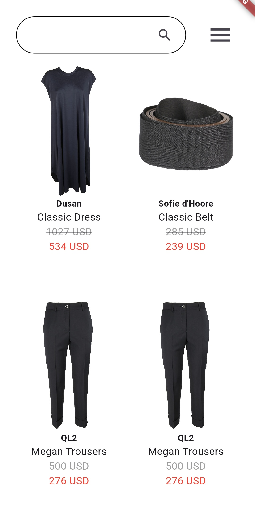

# Products

Show a list of products and search, filter, and browse through it.

## Prerequisites

Make sure you have Flutter 3.24.5 installed on your machine. You can check it with command:

```bash
which flutter
```

## Installation

```bash
git clone https://github.com/bubalopetar/Products.git
```

## Run

```bash
flutter run
```

## Run tests

```bash
flutter test
```

## Features
When the app is started all the items are loaded and shown on the screen.
You can browse through them in infinite scroll, search for specific items or filter items.

<div style="display: flex; justify-content: center;gap: 20px;">
  
  
  
  
</div>